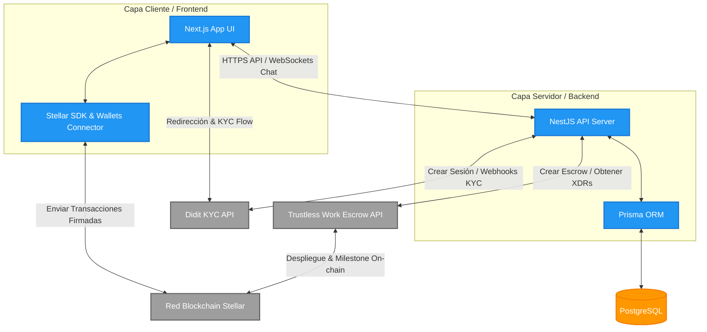
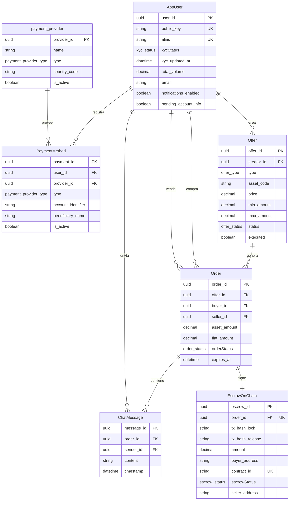
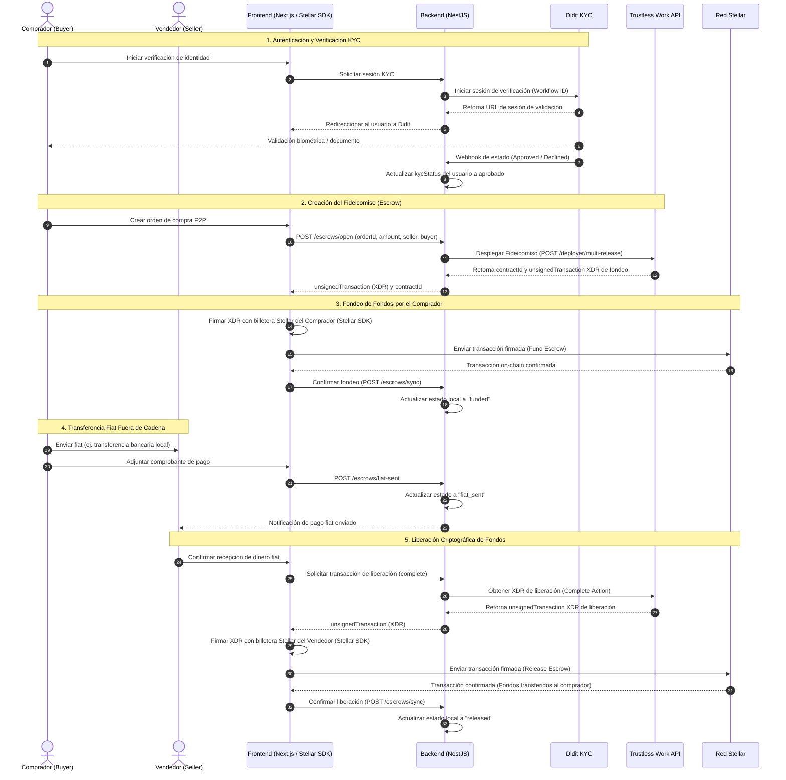

# Arquitectura de Software - iKash P2P

Este documento detalla la arquitectura técnica, el stack tecnológico y los flujos de integración del ecosistema **iKash**.

---

## 1. Stack Tecnológico y Componentes Internos

iKash sigue una arquitectura desacoplada y sin custodia directa de fondos (non-custodial), compuesta por tres bloques de infraestructura interna:

*   **Frontend (`iKash-frontend`)**:
    *   **Tecnología**: Next.js (React), TypeScript, CSS/Tailwind CSS.
    *   **Responsabilidad**: Interfaz de usuario (UI/UX) interactiva, conexión de billeteras de la red Stellar y firma local (en el cliente) de transacciones criptográficas.
*   **Backend (`iKash-backend`)**:
    *   **Tecnología**: NestJS (Node.js), TypeScript.
    *   **Responsabilidad**: Orquestador de la lógica de negocio (búsqueda de ofertas, chat en tiempo real, gestión del estado de órdenes y usuarios, recepción de webhooks de verificación).
*   **Base de Datos**:
    *   **Tecnología**: PostgreSQL gestionado a través de Prisma ORM.
    *   **Responsabilidad**: Persistencia del estado local de los usuarios, ofertas, órdenes, logs de auditoría y metadatos de pagos fiat.

---

## 2. Integración de Servicios Externos

El núcleo de la seguridad y descentralización de iKash se apoya en tres servicios externos clave:

1.  **Trustless Work**:
    *   **Propósito**: Gestión del ciclo de vida de los fideicomisos (*escrows*). Permite desplegar y operar los contratos inteligentes multifirma/milestone directamente en la blockchain de Stellar a través de su API REST, delegando la seguridad de los fondos en contratos auto-ejecutables.
2.  **Stellar SDK**:
    *   **Propósito**: Integración con las billeteras locales de los usuarios (ej. Albedo, Freighter) en el frontend y construcción de las transacciones criptográficas formateadas en XDR (*Transaction Envelope*) en el backend.
3.  **Didit**:
    *   **Propósito**: Autenticación descentralizada y verificación de identidad (KYC) segura de los usuarios, previniendo el fraude y garantizando el cumplimiento normativo mediante flujos interactivos de onboarding.

---

## 3. Diagrama de Arquitectura de Contenedores

Este diagrama detalla los límites del sistema iKash, sus componentes y las integraciones con servicios externos de terceros:

---

## 4. Diagrama del Modelo de Datos (ERD)

Este diagrama representa la estructura de base de datos relacional de iKash según el esquema de Prisma actual:

---

## 5. Flujo del Escrow P2P Integrado con Servicios Externos

El siguiente diagrama de secuencia detalla el proceso corregido de un Escrow P2P, ilustrando cómo el backend interactúa con **Trustless Work** y cómo la firma de transacciones se realiza exclusivamente en el frontend a través del **Stellar SDK**:

---

## 6. Infraestructura de Despliegue

El ecosistema **iKash** se despliega sobre una arquitectura de contenedores escalable y segura utilizando **Google Cloud Run**:

*   **Servidores de Ejecución (Cloud Run)**: Tanto `iKash-frontend` como `iKash-backend` se compilan y empaquetan en contenedores independientes basados en sus respectivos `Dockerfile` y se despliegan en servicios separados de Cloud Run. Esto permite una escalabilidad horizontal automática basada en la demanda de peticiones, reduciendo a cero la infraestructura inactiva.
*   **Aislamiento y Seguridad de Red**:
    *   **Acceso Restringido al Backend**: El backend de iKash está configurado para permitir peticiones únicamente desde el dominio oficial del frontend respectivo. Esto se controla mediante políticas estrictas de Cross-Origin Resource Sharing (CORS) y, opcionalmente, políticas de acceso de IAM en Google Cloud que garantizan que el endpoint del backend no acepte solicitudes no autorizadas de clientes o agentes externos maliciosos.
    *   **Comunicación Segura**: Todo el tráfico entre el cliente, el frontend, el backend y las APIs externas está cifrado en tránsito mediante HTTPS/TLS.

---

## 7. Principios de Diseño y Seguridad

### Separación de Responsabilidades (Separation of Concerns)
*   **Seguridad Criptográfica en el Cliente**: El frontend tiene la responsabilidad exclusiva de comunicarse con las billeteras locales y firmar transacciones. El backend de iKash **nunca** maneja, almacena ni solicita las llaves privadas de los usuarios.
*   **Coordinación en el Servidor**: El backend actúa como un orquestador que centraliza la comunicación con los APIs de confianza (Didit y Trustless Work), almacena la información relacional no sensible (ej. logs de chats, ofertas activas, perfiles de pago fiat) y pre-procesa los envelopes XDR para simplificar el flujo al usuario.

### Protección de la Identidad del Usuario
*   **KYC Descentralizado (Zero Trust)**: Al delegar la verificación en **Didit**, iKash no almacena información de identificación personal altamente regulada (como fotos de pasaportes, escaneos biométricos o documentos de identidad). Únicamente guarda un identificador único anonimizado y el estado final de la validación (`kycStatus: Approved / Rejected`), cumpliendo con altos estándares de privacidad (ej. GDPR/compliance local).

### El Frontend como Capa Conectora Fina
El frontend de iKash funciona como un canal o interfaz de conexión hacia redes de seguridad avanzadas:
1.  **Protección mediante Tokens**: El acceso a los endpoints del backend está restringido mediante JSON Web Tokens (JWT) generados durante la sesión del usuario.
2.  **Garantía de Fideicomiso Descentralizado**: Las operaciones financieras críticas (el bloqueo de cripto y su liberación) no se realizan en servidores de iKash ni dependen de la base de datos local. El frontend conecta directamente al usuario con contratos inteligentes inmutables y auto-ejecutables mediante el **Stellar SDK**, garantizando que ninguna entidad externa (incluyendo a iKash) pueda retener o confiscar fondos sin las firmas correspondientes de las partes.
